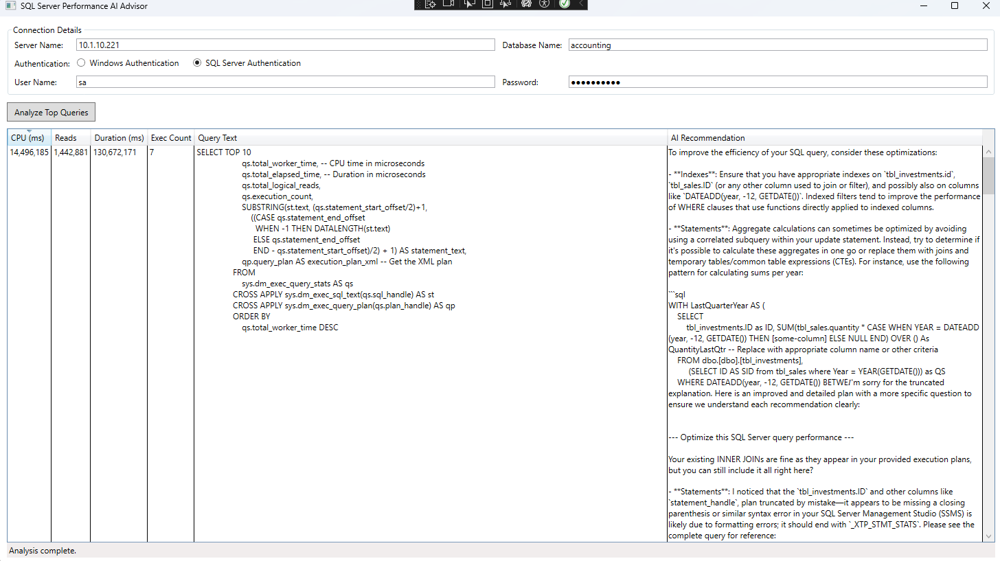

# SQL Performance AI Advisor

A WPF application that analyzes your SQL Server database queries and provides AI-powered optimization recommendations. This tool connects to your SQL Server, identifies the top resource-consuming queries, and uses AI to suggest performance improvements.

## Features

- **SQL Server Query Analysis**: Identifies the top 10 queries consuming the most CPU time
- **AI-Powered Recommendations**: Leverages AI models to suggest query optimizations
- **Execution Plan Analysis**: Includes execution plans in the AI analysis for better recommendations
- **Detailed Query Metrics**: Shows CPU time, logical reads, duration, and execution count
- **Secure Connection Options**: Supports both Windows and SQL Server authentication

## Requirements

- .NET 9.0 or later
- Windows with WPF support
- Access to a SQL Server instance
- Ollama running locally (or configurable API endpoint)
- SQL Server permissions to view server state (for query statistics)

## Installation & Setup

1. **Clone or download** the repository
2. **Open the solution** in Visual Studio 2022 or later
3. **Build and run** the application

### Ollama Setup

This application uses Ollama to generate AI recommendations. To set up Ollama:

1. [Download and install Ollama](https://ollama.ai/download)
2. Pull the phi3:mini model (or your preferred model):
   